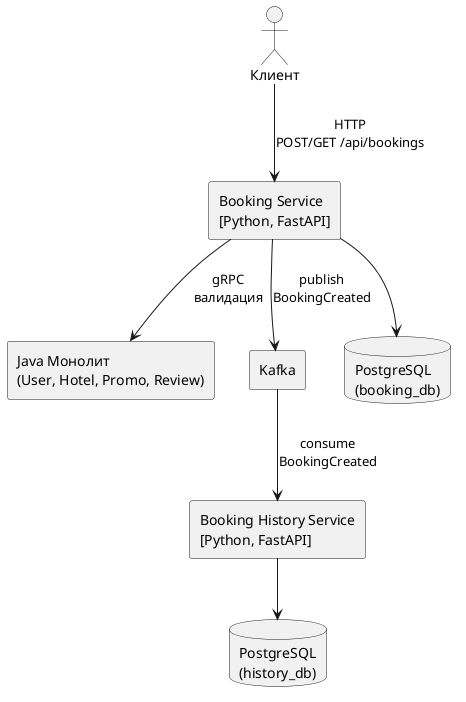
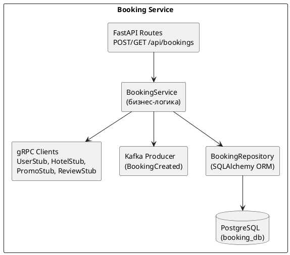
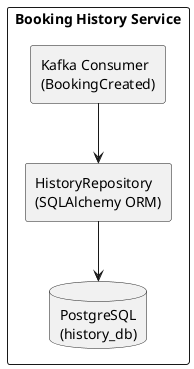
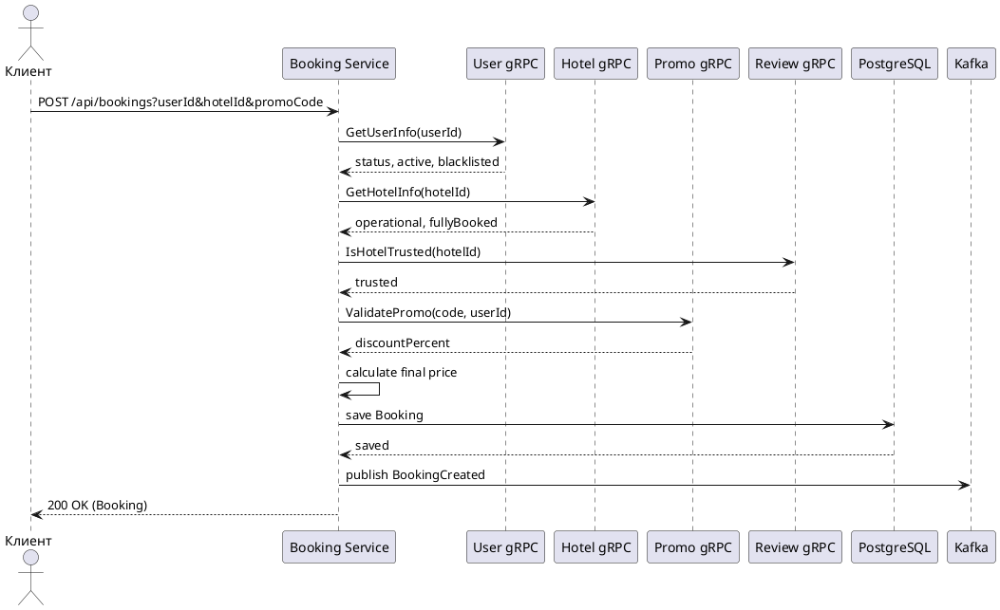
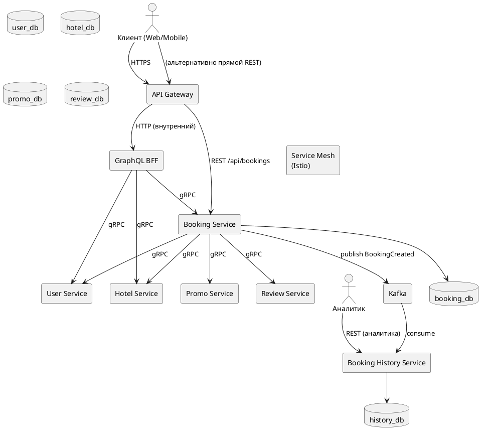

# ADR-001: Вынос Booking Service и создание Booking History Service

### **Название задачи:**
Миграция модуля бронирований (Booking) из Java-монолита Hotelio в два отдельных микросервиса на Python: `booking-service` (приём и валидация бронирований) и `booking-history-service` (асинхронная запись событий для аналитики). Первый шаг перехода от монолита к микросервисной архитектуре (паттерн Strangler Fig).

### **Автор:**
Архитектурный анализ

### **Дата:**
2026-04-05

---

### **Функциональные требования**

| № | Действующие лица или системы | Use Case | Описание |
| :-: | :- | :- | :- |
| UC-1 | Клиент (Web/Mobile) | Создание бронирования | Клиент отправляет `POST /api/bookings?userId=...&hotelId=...&promoCode=...`. Booking Service проверяет пользователя (активен, не в чёрном списке), отель (работает, не полностью забронирован, доверенный по отзывам), применяет промокод, рассчитывает цену (VIP — 80, остальные — 100, минус скидка промокода) и сохраняет бронирование в свою БД. |
| UC-2 | Клиент (Web/Mobile) | Просмотр бронирований | Клиент отправляет `GET /api/bookings` или `GET /api/bookings?userId=...`. Booking Service возвращает список бронирований из своей БД. |
| UC-3 | Booking Service | Валидация через монолит | Booking Service вызывает gRPC-методы монолита: `UserService.GetUserInfo`, `HotelService.GetHotelInfo`, `PromoService.ValidatePromo`, `ReviewService.IsHotelTrusted`. |
| UC-4 | Booking Service | Публикация события | После успешного сохранения бронирования Booking Service публикует событие `BookingCreated` в Kafka-топик `bookings`. |
| UC-5 | Booking History Service | Подписка на события | Booking History Service читает события `BookingCreated` из Kafka и сохраняет полную историю бронирований в свою БД для целей аналитики (по пользователям, отелям, дням). |

---

### **Нефункциональные требования**

| № | Требование |
| :-: | :- |
| NFR-1 | Оба сервиса на Python 3.11+, FastAPI |
| NFR-2 | Каждый сервис имеет собственную PostgreSQL базу данных |
| NFR-3 | SQLAlchemy + Alembic для ORM и миграций |
| NFR-4 | gRPC (`grpcio`, `grpcio-tools`) для вызовов Booking Service → монолит |
| NFR-5 | Общие `.proto`-контракты: `user.proto`, `hotel.proto`, `promo.proto`, `review.proto`, `booking.proto` |
| NFR-6 | Kafka (Confluent cp-kafka 7.2.1) + Zookeeper для асинхронной передачи событий |
| NFR-7 | Kafka-producer в booking-service, Kafka-consumer в booking-history-service |
| NFR-8 | Docker-контейнеризация, общая сеть `hotelio-net` |
| NFR-9 | Логирование всех запросов и событий (уровень INFO) |
| NFR-10 | Таймауты и retry-политика на gRPC-вызовы и Kafka |

---

### **Решение**

#### Диаграмма контекста (C4 — Context)

#### Диаграмма контейнеров — Booking Service

#### Диаграмма контейнеров — Booking History Service

#### Диаграмма последовательности — Создание бронирования

#### Логика принятия решений

1. **Python + FastAPI:** команда не владеет Java. FastAPI — асинхронный фреймворк с автоматической OpenAPI-документацией и минимальным бойлерплейтом.
2. **gRPC для синхронных вызовов:** строгий контракт через `.proto`, бинарный формат, автогенерация клиентов. Монолит уже включает gRPC-зависимости (`grpc-netty`, `grpc-protobuf`, `grpc-stub`).
3. **Kafka для асинхронных событий:** отдел аналитики не имеет доступа к боевой БД. События `BookingCreated` в Kafka позволяют booking-history-service независимо накапливать историю без дополнительной логики в booking-service.
4. **Разделение ответственности:** booking-service занимается валидацией и созданием бронирований. booking-history-service — только чтением из Kafka и записью в свою БД для аналитики.
5. **Database-per-Service:** настоящая независимость. Каждый сервис управляет своей схемой.
6. **Strangler Fig:** постепенная миграция. Монолит работает, booking-service перехватывает `/api/bookings`.

---

### **Альтернативы**

| Альтернатива | Почему отклонена |
| :- | :- |
| **REST вместо gRPC** | gRPC обеспечивает строгий контракт, меньшую задержку. Монолит уже имеет gRPC-зависимости. |
| **Одна БД для обоих сервисов** | Нарушает принцип database-per-service, создаёт coupling. |
| **Добавить аналитику прямо в booking-service** | Нарушает SRP, увеличивает нагрузку на критичный сервис. |
| **Big Bang миграция** | Слишком рискованно. Strangler Fig позволяет откатиться. |
| **HTTP polling вместо Kafka** | Неэффективно, задержки, лишняя нагрузка. |

#### Недостатки, ограничения, риски

| Риск | Влияние | Митигация |
| :- | :- | :- |
| `ddl-auto: create` в монолите стирает данные при каждом рестарте | 🔴 Высокая | Первым делом заменить на `validate` или `update` |
| gRPC-сервер нужно поднять в монолите (сейчас только REST) | 🔴 Высокая | Добавить `.proto` файлы и gRPC-эндпоинты в монолит как подготовительный шаг |
| Синхронные gRPC-вызовы — цепочка из 4 зависимостей на каждый запрос | Средняя | Таймауты, circuit breaker. В будущем — кэширование. |
| Kafka-события могут потеряться при недоступности consumer | Средняя | Kafka гарантирует persistence, retry в consumer. Idempotency-ключи. |
| Две разные кодовые базы (Java + Python) усложняют поддержку | Средняя | Общие `.proto` как единый источник правды. |
| Промокод и цена — хардкод (VIP=80, остальные=100) | Низкая | Копируем как есть, рефакторинг — отдельная задача. |

---

### **План миграции (Strangler Fig)**

| Фаза | Задачи | Результат |
| :- | :- | :- |
| **0. Подготовка** | Исправить `ddl-auto`. Определить `.proto` контракты (`booking.proto`, `user.proto`, `hotel.proto`, `promo.proto`, `review.proto`). Реализовать gRPC-эндпоинты в монолите. | Монолит стабилен, gRPC готов |
| **1. Booking Service — скелет** | Python/FastAPI проект, gRPC-клиенты из `.proto`, Docker, `GET /api/bookings` через gRPC к монолиту. Собственная БД (SQLAlchemy + Alembic). | Сервис запускается, читает данные |
| **2. Booking Service — полная логика** | `POST /api/bookings` с валидациями через gRPC и расчётом цен. Kafka-producer публикует `BookingCreated`. | Полная parity с монолитом |
| **3. Booking History Service** | Kafka-consumer читает `BookingCreated`, сохраняет в свою БД. Эндпоинты для аналитики (по пользователям, отелям, дням). | Аналитика работает |
| **4. Роутинг** | API Gateway: `/api/bookings/**` → booking-service. Canary 10%. Environment: `BOOKING_SERVICE_EXTERNAL_HOST`, `BOOKING_SERVICE_EXTERNAL_PORT`. | Трафик перенаправлен |
| **5. Отрезание** | Удалить Booking-код из монолита. Миграция данных. Убедиться, что booking-history-service продолжает получать события. | Оба сервиса независимы |

## Целевое состояние системы (через год)

После завершения всех этапов миграции монолитное Java-приложение будет полностью заменено набором независимых микросервисов. Каждый сервис отвечает за строго ограниченную бизнес-область, имеет собственную базу данных и публичный API (REST/gRPC/GraphQL). Асинхронные взаимодействия реализованы через Kafka, синхронные — через gRPC с таймаутами и retry. Внедрены service mesh (Istio), метрики (Prometheus) и распределённая трассировка (Jaeger). Для фронтенда предоставляется GraphQL BFF (Backend For Frontend).

### Состав сервисов и их ответственность

| Сервис | Ответственность | Тип API | База данных |
| ------ | --------------- | ------- | ------------ |
| **User Service** | Управление профилями пользователей, статусами (активен/чёрный список), аутентификация/авторизация. | gRPC + REST | `user_db` |
| **Hotel Service** | CRUD отелей, поиск, фильтрация, заполненность номеров. | gRPC + REST | `hotel_db` |
| **Promo Service** | Жизненный цикл промокодов, проверка применимости, расчёт скидки. | gRPC | `promo_db` |
| **Review Service** | Отзывы и рейтинг отелей, определение «доверенного» отеля. | gRPC + REST | `review_db` |
| **Booking Service** | Приём и валидация бронирований, расчёт финальной цены, сохранение в своей БД, публикация события `BookingCreated`. | REST (для клиентов) + gRPC (внутренний) | `booking_db` |
| **Booking History Service** | Подписка на `BookingCreated`, хранение полной истории бронирований для аналитики. Предоставляет агрегирующие эндпоинты (по пользователям, отелям, дням). | REST (только для аналитиков) | `history_db` |
| **API Gateway** | Единая точка входа для внешних клиентов, маршрутизация, аутентификация, лимиты. | REST / WebSocket | — |
| **GraphQL BFF** | Адаптация данных под нужды фронтенда (Web/Mobile), агрегация вызовов к нескольким сервисам. | GraphQL | — |

### Диаграмма контекста целевой архитектуры

### Принципы взаимодействия

- **Синхронные вызовы** между сервисами — только через gRPC с таймаутами, retry и circuit breaker (реализуется через service mesh).
- **Асинхронные события** — Kafka, гарантия доставки *at-least-once*, идемпотентность обработки.
- **Database-per-Service** — никаких общих таблиц, только обмен через API или события.
- **GraphQL BFF** — один на все фронтенды, скрывает микросервисную сложность.
- **API Gateway** — обеспечивает авторизацию, лимиты, логирование и маршрутизацию.

---

## Очередность миграции остальных сервисов (после Booking)

Первый шаг (Booking + Booking History) уже описан в ADR-001. Далее предлагается следующая очерёдность, основанная на снижении связанности и максимизации пользы для бизнеса.

| Очередь | Сервис | Обоснование | Ключевые зависимости | Ожидаемая длительность |
| :-----: | ------ | ----------- | -------------------- | ----------------------- |
| **2** | **User Service** | Является фундаментальным для многих сервисов (Booking, Promo, Review). Вынос позволит остальным сервисам получать данные пользователя через gRPC, а не напрямую из БД монолита. | Монолит (UserController, UserService) | 2–3 недели |
| **3** | **Hotel Service** | Используется Booking Service и будущим Search Service. Высокая частота запросов, вынос улучшит масштабируемость поиска. | Монолит (HotelController, HotelService) | 2 недели |
| **4** | **Promo Service** | Логика промокодов меняется часто, изоляция ускорит доставку фич. | User Service (для проверки применимости к пользователю) | 1–2 недели |
| **5** | **Review Service** | Относительно независим, но влияет на доверие к отелю в Booking Service. Выносится после Hotel Service. | Hotel Service (проверка существования отеля) | 1 неделя |
| **6** | **API Gateway + GraphQL BFF** | После выноса всех бизнес-сервисов можно переключить внешний трафик с монолита на шлюз. | Все сервисы | 2 недели |
| **7** | **Отключение монолита** | Удаление кода всех вынесенных сервисов из монолита, перенос последних миграций данных. | Все сервисы | 1 неделя |

### План миграции по этапам (после завершения фазы 5 из ADR-001)

| Фаза | Задачи | Результат |
| :--: | ------ | --------- |
| **6** | **Вынос User Service**  - Создать Python/FastAPI проект, gRPC-сервер (методы `GetUserInfo`, `GetUserStatus`).  - Скопировать данные из монолита в `user_db`.  - Переключить Booking Service на вызов нового User Service (feature flag).  - Удалить `UserService` из монолита. | User Service работает независимо, монолит уменьшен. |
| **7** | **Вынос Hotel Service**  - Аналогично, создать сервис с gRPC (`GetHotelInfo`, `SearchHotels`).  - Переключить Booking Service и Review Service на него. | Hotel Service независим. |
| **8** | **Вынос Promo Service**  - gRPC-сервер `ValidatePromo`.  - В Booking Service заменить вызов. | Promo Service изолирован. |
| **9** | **Вынос Review Service**  - gRPC-сервер `IsHotelTrusted`.  - Переключить Booking Service. | Review Service независим. |
| **10** | **Внедрение API Gateway и GraphQL BFF**  - Развернуть Kong/Envoy + Apollo Federation (или аналог).  - Настроить маршруты: `/api/bookings/**` → Booking Service, `/api/users/**` → User Service и т.д.  - GraphQL-схема, объединяющая отели, бронирования, пользователей. | Единая точка входа, фронтенд переходит на GraphQL. |
| **11** | **Service Mesh, мониторинг, трассировка**  - Установить Istio, настроить mTLS, circuit breakers.  - Prometheus + Grafana дашборды.  - Jaeger для трассировки всех gRPC-вызовов. | Полная наблюдаемость. |
| **12** | **Финализация**  - Удалить из монолита все вынесенные контроллеры, сервисы и DAO.  - Остановить монолит.  - Перенести оставшиеся фоновые задачи (если есть) в отдельные сервисы. | Монолит полностью заменён. |

### Риски и митигации на последующих этапах

| Риск | Влияние | Митигация |
| ---- | ------- | ---------- |
| Потеря данных при миграции пользователей/отелей | Высокое | Двойная запись (write to both) в течение переходного периода, сверка контрольных сумм. |
| Увеличение задержек из-за цепочки gRPC-вызовов (User → Hotel → Promo) | Среднее | Service mesh с circuit breaker, кэширование (Redis) в каждом сервисе, асинхронные fallback'и. |
| Разрастание количества сервисов → сложность локальной разработки | Среднее | Docker Compose с профилями, среда для разработки с поднятием только нужных сервисов. |
| Несовместимость .proto контрактов при параллельных изменениях | Среднее | Общий репозиторий `proto`, версионирование (например, `v1/...`), CI-проверка на breaking changes. |
